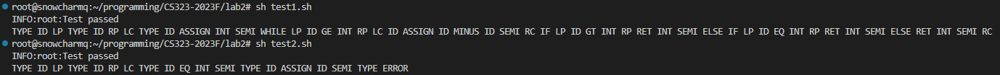

# CS323 Lab Assignment 1

### Running Environment: 
Ubuntu 9.4.0-1ubuntu1~20.04.1
Python 3.8.10

### Running Arguments:

| Argument              | Function                                                     |
| --------------------- | ------------------------------------------------------------ |
| -h, --help            | show this help message and exit                              |
| --code_path CODE_PATH | root of code file to be analyzed                             |
| --ans_path ANS_PATH   | root of answer file to be compared                           |
| --test                | test mode, if set this value, the program will compare the result generated by the program with the standard answer |
| --debug               | debug mode, if set this value, the program will print some logs for debugging |

### How to Run:
In Linux system, the **sheel** file can be executed directly. The results will also be printed in the console.
##### Test Case 1: 
`sh test1.sh` or `python3 lexical_analyzer.py --code_path test1.spl --ans_path ans1.txt --test`
##### Test Case 2:
`sh test2.sh` or `python3 lexical_analyzer.py --code_path test2.spl --ans_path ans2.txt --test`

### Screenshot:
